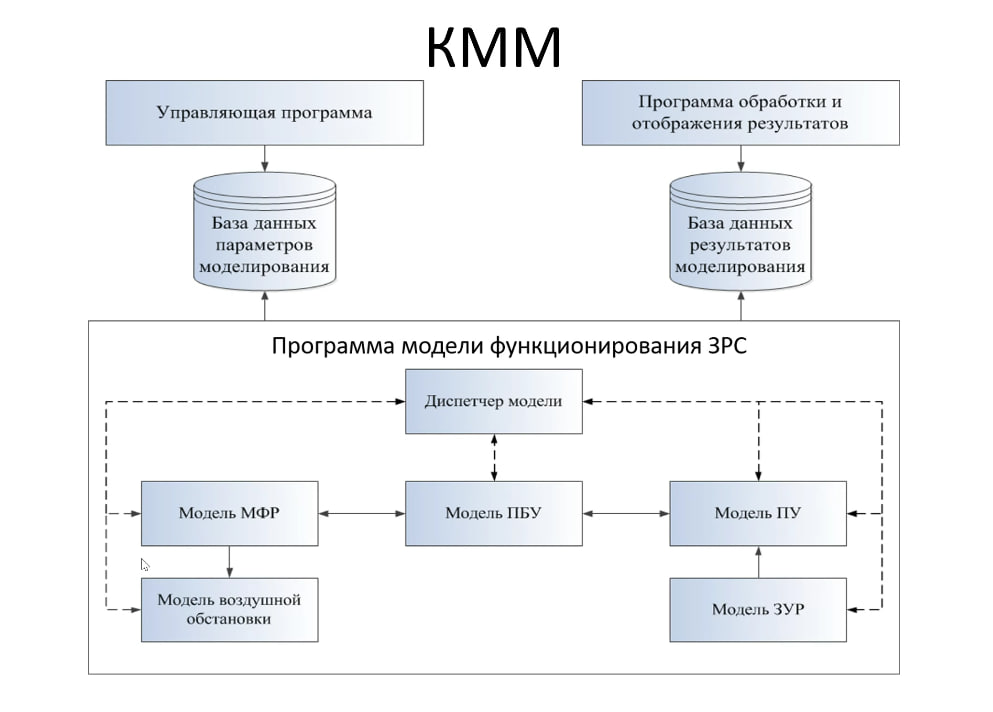
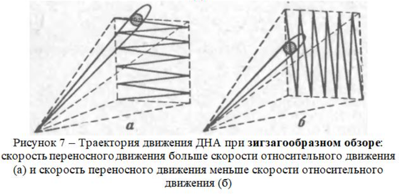

# KMM_project

**Проект по предмету "Компьютерное моделирование" на 4 курсе, МФТИ ФАЛТ. Весна 2024 года**

**Цель**: Моделирование работы ЗРС

## Архитектура проекта:

## Состав команды "Синий Шуршунчик":

### Структура репозитория

- src/
  - classes/ - классы модулей
    - pass
  - messages/ - классы сообщений
    - pass
  
- config/ конфиг

[Ссылка на YouTrack, где распределены все задачи по ходу проекта](https://km-pgithubroject.youtrack.cloud/agiles/160-2/current)

[Ссылка на UML-диаграмму](https://drive.google.com/file/d/1ucT0xLzZWOYp1hiXnceom4LKOXFYfxBC/view?usp=sharing)
## РЛС
В РЛС кругового типа обзор происходит по винтовой траектории:

В РЛС секторного типа обзор происходит по зигзагообразной траектории:

Диапозон действия РЛС различных типо варьируется до 500 км, минимальная дальность обнаружения составляет 30 м.
В составе зенитных ракетных комплексов разных типов есть свои собственные РЛС для сопровождения целей и управления стрельбой. Например, система войсковой ПВО С-300В комплектуется станциями, способными засекать и брать на сопровождение воздушные цели на дальностях до 150 км. 
Дальность действия РЛС в составе нашего моделируемого комплекса фиксированная - 50 км.

У современных PЛC среднеквадратические радиальные ошибки определения координат в зависимости от дальности до ЛА и типа PЛC могут составлять от 0,8 до 2,7 км.
Мы выбираем ошибку в зависимости от дальности до ЛА с коэффициентом 0.05.

Литература:
1. https://www.ql-journal.ru/ru/node/667?ysclid=lw0dhcehpv972223721
2. https://studopedia.su/9_34750_oshibki-v-opredelenii-koordinat.html
3. https://www.radartutorial.eu/01.basics/rb10.ru.html
4. https://www.radartutorial.eu/02.basics/rp12.ru.html
5. https://topwar.ru/198738-obnaruzhenie-i-soprovozhdenie-radiolokacionnye-stancii-v-specoperacii.html

## Самолет
- изначально скорость равна **555 м/c**
- ограничение скорости для самолета **220 - 700 м/c**

## ЗУР
- Дефолтная скорость равна **1200 м/с**
- ограничение скорости для самолета **1100 - 2200 м/c**

