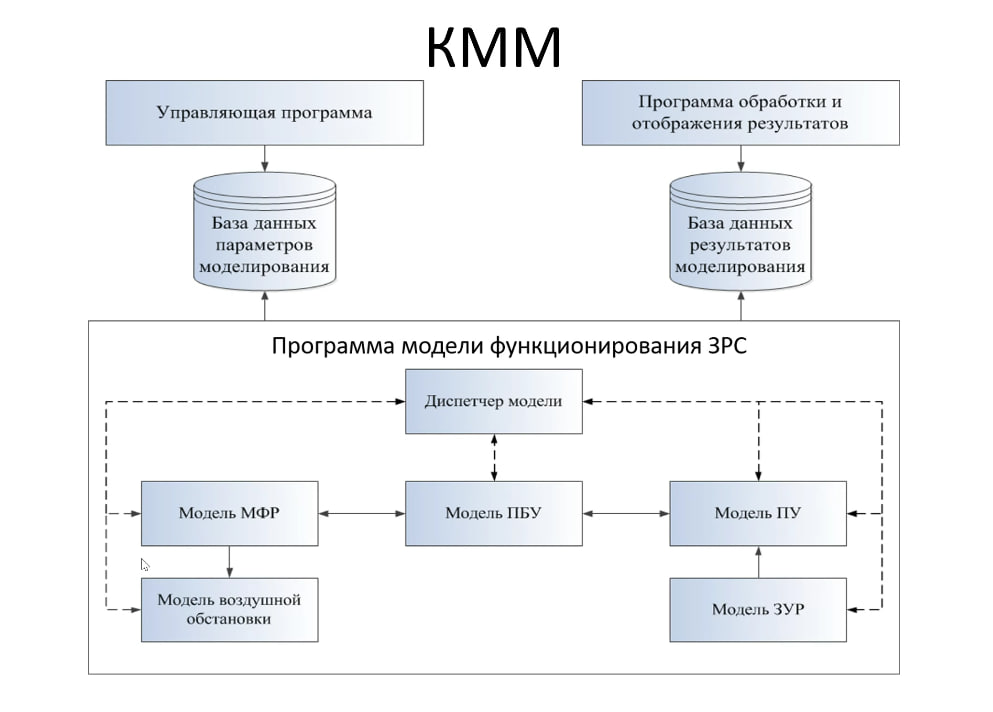
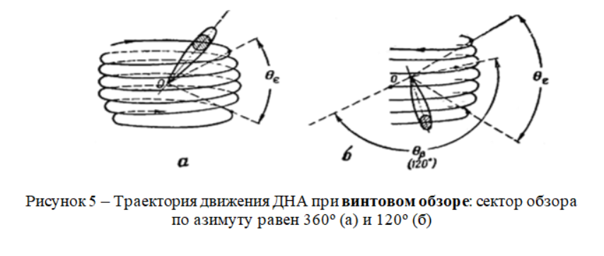
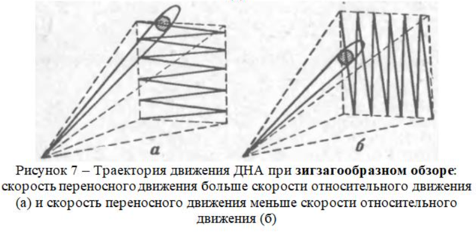

# KMM_project

**Проект по предмету "Компьютерное моделирование" на 4 курсе, МФТИ ФАЛТ. Весна 2024 года**

**Цель**: Моделирование работы ЗРС

## Архитектура проекта:

## Состав команды "Синий Шуршунчик":
- Песоцкая Алиса - lead
- Юсупов Сафуан 
- Лаптева Арина
- Аллабердин Богдан
- Орлова Алина 
- Евдокимов Илья

### Распределение задач:
- Песоцкая Алиса - класс ПБУ
- Юсупов Сафуан - класс ЗУР
- Лаптева Арина - класс МФР
- Аллабердин Богдан - класс Диспетчер, класс Сообщения
- Орлова Алина - класс ПУ
- Евдокимов Илья - класс ВО

### Структура репозитория

- src/
  - classes/ - классы модулей
    - pass
  - messages/ - классы сообщений
    - pass
  
- config/ конфиг

[Ссылка на YouTrack, где распрелены все задачи по ходу проекта](https://km-pgithubroject.youtrack.cloud/agiles/160-2/current)

## РЛС
В РЛС кругового типа обзор происходит по винтовой траектории:

В РЛС секторного типа обзор происходит по зигзагообразной траектории:

