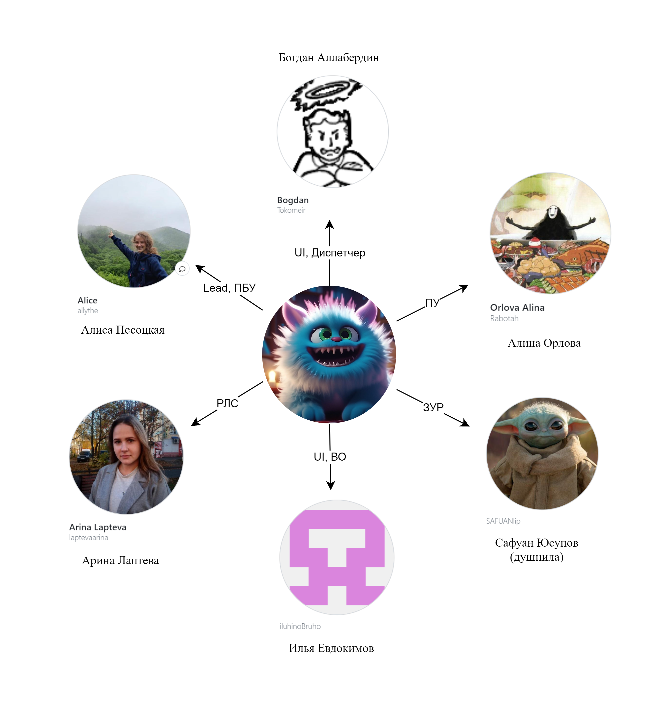

# KMM_project

**Проект по предмету "Компьютерное моделирование" на 4 курсе, МФТИ ФАЛТ. Весна 2024 года**

**Цель**: Моделирование работы ЗРС

## Архитектура проекта:

## Состав команды "Синий Шуршунчик":

### Структура репозитория

- src/
  - classes/ - классы модулей
    - pass
  - messages/ - классы сообщений
    - pass
  
- config/ конфиг

[Ссылка на YouTrack, где распределены все задачи по ходу проекта](https://km-pgithubroject.youtrack.cloud/agiles/160-2/current)

[Ссылка на UML-диаграмму](https://drive.google.com/file/d/1ucT0xLzZWOYp1hiXnceom4LKOXFYfxBC/view?usp=sharing)
## РЛС
В РЛС кругового типа обзор происходит по винтовой траектории:

В РЛС секторного типа обзор происходит по зигзагообразной траектории:

